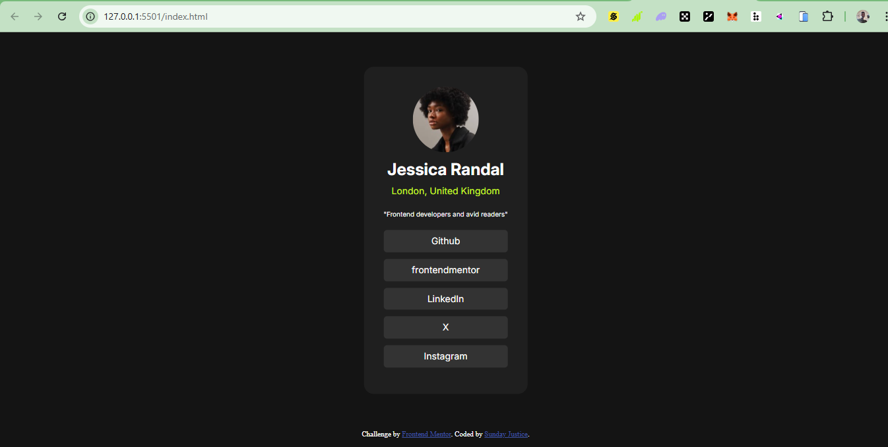

# Frontend Mentor - Social links profile solution

This is a solution to the [Social links profile challenge on Frontend Mentor](https://www.frontendmentor.io/challenges/social-links-profile-UG32l9m6dQ). Frontend Mentor challenges help you improve your coding skills by building realistic projects. 

## Table of contents

- [Frontend Mentor - Social links profile solution](#frontend-mentor---social-links-profile-solution)
  - [Table of contents](#table-of-contents)
  - [Overview](#overview)
    - [The challenge](#the-challenge)
    - [Screenshot](#screenshot)
    - [Links](#links)
  - [My process](#my-process)
    - [Built with](#built-with)
    - [Continued development](#continued-development)
  - [Author](#author)
  - [Acknowledgments](#acknowledgments)

**Note: Delete this note and update the table of contents based on what sections you keep.**

## Overview

### The challenge

### Screenshot

### Links

- Solution URL: [Github Repository](https://github.com/zuru122/AdvanceCSS/tree/main/social-links-profile-main)
- Live Site URL: [Live link](https://socials-kappa-three.vercel.app/)

## My process
* I creat a html structure
* used css and made sure I apply the responsiveness by setting my root font to rem
* I made use of media query to enable mobil responsible
* I made use of Desktop first approach

### Built with

- Semantic HTML5 markup
- CSS custom properties
- Flexbox
- CSS Grid
- Mobile-first workflow

### Continued development

I want to focus more on responsiveness, and building a neat and beautiful sites with cool animation
and I know with Advance CSS course I'm taking, with practice, I will be able to achieve my goal.

## Author

- Website - [Project site](https://socials-kappa-three.vercel.app/)
- Frontend Mentor - [zuru122](https://www.frontendmentor.io/profile/zuru122)
- Twitter - [@zurudcoder](https://x.com/zurudcoder)

**Note: Delete this note and add/remove/edit lines above based on what links you'd like to share.**

## Acknowledgments
I want to thank Mr. Jonas for putting out a comprehensive and well structured course tailored to help me develop and understand the industry standard of writing code and also Temi Turner my colleague for helping me out when I am stuck  and showing me that with CSS I can make any design I want
